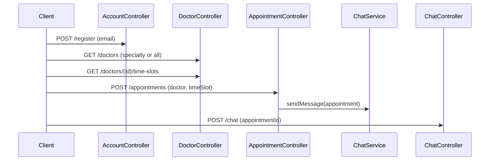

<h1 align="center">🏥 Doctor Appointments Backend</h1>

[.Net]: https://img.shields.io/badge/.NET-5C2D91?style=for-the-badge&logo=.net&logoColor=white
[C#]: https://custom-icon-badges.demolab.com/badge/C%23-%23239120.svg?logo=csharp&style=for-the-badge&logoColor=white
[SQLServer]: https://img.shields.io/badge/Microsoft%20SQL%20Server-CC2927?style=for-the-badge&logo=microsoft%20sql%20server&logoColor=white
[Redis]: https://img.shields.io/badge/Redis-DC382D?style=for-the-badge&logo=redis&logoColor=white
[SignalR]: https://img.shields.io/badge/SignalR-FF6F00?style=for-the-badge&logo=signalr&logoColor=white
[Serilog]: https://img.shields.io/badge/Serilog-333333?style=for-the-badge&logo=serilog&logoColor=white
[FluentValidation]: https://img.shields.io/badge/Fluent%20Validation-006600?style=for-the-badge

![.Net] ![C#] ![SQLServer] ![Redis] ![SignalR] ![Serilog] ![FluentValidation]

<p align="center">
  <b>A modern healthcare platform built with ASP.NET Core following Clean Architecture principles, connecting patients with medical professionals seamlessly.</b>
</p>


## 🌟 Features

- **Secure Authentication** with JWT & Refresh Tokens
- **Real-Time Chat** using SignalR
- **Doctor Discovery System** with advanced search filters
- **Appointment Management** with scheduling capabilities
- **Redis Caching** for high-performance operations
- **Structured Logging** with Serilog
- **Validation** with FluentValidation
- **Auto-Mapping** with Mapster

## 🛠 Tech Stack

- **Framework**: .NET 8
- **Database**: SQL Server + Entity Framework Core
- **Real-Time**: SignalR
- **Caching**: Redis
- **Logging**: Serilog
- **Validation**: FluentValidation
- **Mapping**: Mapster
- **Architecture**: Clean Architecture

## 🧩 Design Patterns

- **Clean Architecture** - Separation of concerns
- **Repository Pattern** - Abstracted data access
- **Unit of Work** - Transaction management
- **Specification Pattern** - Query encapsulation

## system design

[Doctor Appointments UI– Figma](https://www.figma.com/design/mUyzEodsuIfhBGvVE2fz1p/Doctor-Appointments-UI-KIt-(Community)?node-id=0-72&p=f&t=aL5mkyUKvdsGr8Wb-0)




## 💻 Local Development

**Prerequisites**:
- [.NET 8 SDK](https://dotnet.microsoft.com/download)
- [SQL Server](https://www.microsoft.com/sql-server)
- [Redis](https://redis.io/docs/getting-started/installation/)

**Setup**:
```bash
git clone https://github.com/Open-Sourcers/DocLink-Backend
dotnet restore
dotnet ef database update
dotnet run
```

## 📚 API Documentation

Explore endpoints interactively via Swagger UI:
```
https://doclink.runasp.net/swagger/index.html
```

## ⚡ Real-Time Chat

**SignalR Hub Endpoint**:
```http
POST /chatHub
```

Features:
- Instant messaging between patients and doctors
- Online status notifications
- Message history persistence

## 📈 Logging Configuration

**Serilog Sinks**:
- Console
- File (JSON format)
- Seq (optional)

**Sample Configuration**:
```json
"Serilog": {
  "WriteTo": [
    { "Name": "Console" },
    { "Name": "File", "Args": { "path": "Logs/log.json", "formatter": "Serilog.Formatting.Json.JsonFormatter" } }
  ]
}
```

## 🔍 Cache Strategies

**Redis Implementations**:
- Doctor profile caching (5-minute sliding expiration)
- Specialty list caching (1-hour absolute expiration)
- Rate limit counters

## 📡 API Endpoints

### Authentication

| Method | Endpoint                       | Description                   |
|--------|--------------------------------|-------------------------------|
| POST   | `/api/Account/Register`        | Patient/Doctor registration   |
| POST   | `/api/Account/Login`           | JWT authentication            |
| POST   | `/api/Account/forget-password` | Forgot password               |
| PUT    | `/api/Account/Reset-Password`  | Reset password                |
| GET    | `/api/Account/emailExists`     | Check if email exists         |
| POST   | `/api/Account/SignIn-Google`   | Sign in with Google           |
| POST   | `/api/Account/SignIn-Facebook` | Sign in with Facebook         |
| POST   | `/api/Account/Confirm-Email`   | Confirm email                 |

### Appointments

| Method | Endpoint                        | Description               |
|--------|---------------------------------|---------------------------|
| POST   | `/api/Appointment`              | Create new appointment    |
| PUT    | `/api/Appointment`              | Update appointment        |
| DELETE | `/api/Appointment`              | Delete appointment        |
| GET    | `/api/Appointment/AppointmentDetails` | Get appointment details |
| GET    | `/api/Appointment/Appointments` | Get all appointments      |
| GET    | `/api/Appointment/TimeSlotsStatus` | Get time slots status    |

### Doctors

| Method | Endpoint                       | Description                  |
|--------|---------------------------------|------------------------------|
| GET    | `/api/Doctor/GetDoctorsWithSpec` | Get doctors by specialty     |
| GET    | `/api/Doctor/GetDoctorDetails/{Id}` | Get doctor profile         |
| POST   | `/api/Doctor/CreateDoctorAccount` | Create doctor account       |
| DELETE | `/api/Doctor/DeleteDoctor/{id}`  | Delete doctor account       |
| PUT    | `/api/Doctor/UpdateDoctor`       | Update doctor profile       |
| GET    | `/api/Doctor/GetDoctorLanguages` | Get doctor languages        |
| GET    | `/api/Doctor/GetDoctorQualifications` | Get doctor qualifications |
| GET    | `/api/Doctor/GetSpecialties`    | Get specialties              |
| POST   | `/api/Doctor/CreateSpecialty`   | Create new specialty         |

### Patients

| Method | Endpoint                      | Description               |
|--------|-------------------------------|---------------------------|
| GET    | `/api/Patient/GetPatient`      | Get patient profile       |
| PUT    | `/api/Patient/UpdatePatient`   | Update patient info       |
| POST   | `/api/Patient/AddRate`         | Add a rating for a doctor |

### Chat

| Method | Endpoint                       | Description               |
|--------|--------------------------------|---------------------------|
| POST   | `/api/v1/chat`                 | Send message              |
| GET    | `/api/v1/chat/{id}`            | Get conversation history  |


## 🤝 Contributing

1. Fork the repository
2. Create your feature branch (`git checkout -b feature/AmazingFeature`)
3. Commit your changes (`git commit -m 'Add some AmazingFeature'`)
4. Push to the branch (`git push origin feature/AmazingFeature`)
5. Open a Pull Request

<p align="center">
  Made with ❤️ | Connect patients with care
</p>
